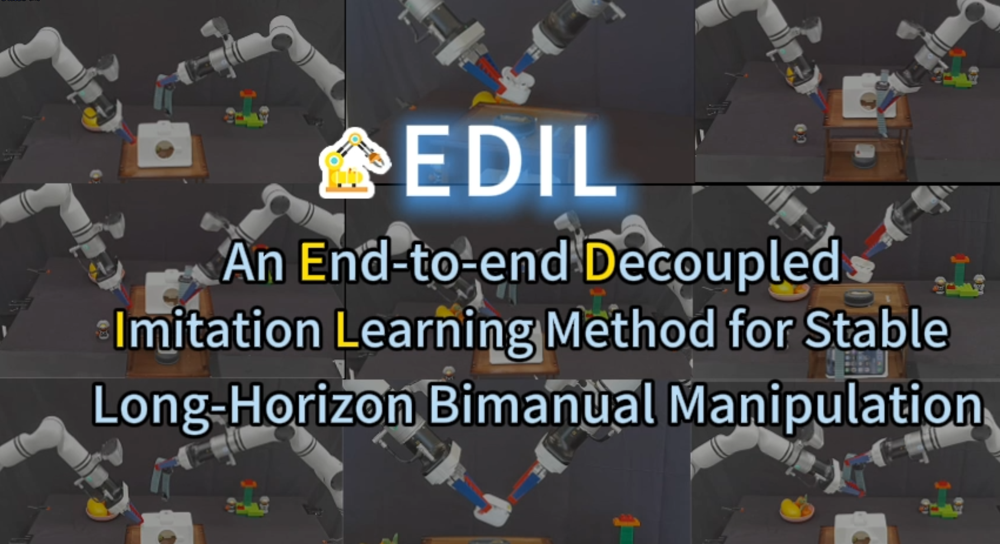

# EDIL: An End-to-end Decoupled Imitation Learning Method for Stable Long-Horizon Bimanual Manipulation



# Abstract

As a critical capability for automating complex industrial tasks like precision assembly, bimanual fine-grained manipulation has become a key area of research in robotics, where end-to-end imitation learning (IL) has emerged as a prominent paradigm. However, in long-horizon cooperative tasks, prevalent end-to-end methods suffer from an inadequate representation of critical task features, particularly those essential for fine-grained coordination between the arms and grippers. This deficiency often destabilizes the manipulation policy, leading to issues like spurious gripper activations and culminating in task failure. To address this challenge, we propose an end-to-end Decoupled Imitation Learning (EDIL) method, which decouples the bimanual manipulation task into a Multimodal Arm Policy for global trajectories and a Temporally-Coordinated Attentive Gripper Policy for fine end-effector actions. The arm policy leverages a Transformer-based encoder-decoder architecture to learn multimodal trajectory from expert demonstrations. The gripper policy leverages cross-attention to facilitate implicit, dynamic feature sharing between the arms, integrating sequential state history and visual data to ensure cooperative stability. \rev{We evaluated EDIL on three challenging long-horizon manipulation tasks.} Experimental results demonstrate that our method significantly outperforms state-of-the-art approaches, particularly on more complex subtasks, showcasing its robustness and effectiveness. Our Project website: \url {[https://decoupledmani.online/}](https://decoupledmani.online/})

# Setup

# Data collection

## collection

The raw data is collected and stored in HDF5 (`.hdf5`) format. Each file typically represents a single episode.
The structure of the HDF5 file includes:

- `**action**`: A dataset containing the robot's joint positions and gripper states.
  - Columns 0-6: Left arm joint angles (6 joints) + Left gripper state.
  - Columns 7-13: Right arm joint angles (6 joints) + Right gripper state.
- `**observations/images**`: A group containing image data from multiple camera views.
  - `cam_high`: Top view camera frames.
  - `cam_bottom`: Bottom view camera frames.
  - `cam_left`: Left wrist camera frames.
  - `cam_right`: Right wrist camera frames.

## preparation

To prepare the data for the **Temporally-Coordinated Attentive Gripper Policy**, we convert the raw HDF5 files into a format that separates visual and action data for each arm:

1. **Action Extraction**:
  - The `action` dataset is split into two CSV files:
    - `*_actions_left.csv`: Contains 6 joint angles + 1 gripper state for the left arm.
    - `*_actions_right.csv`: Contains 6 joint angles + 1 gripper state for the right arm.
2. **Video Extraction**:
  - Image datasets (`cam_left`, `cam_right`) are converted into MP4 video files (`*_cam_left.mp4`, `*_cam_right.mp4`) to facilitate efficient sequence loading during training.
3. **Organization**:
  - Processed files are saved in a structured directory (e.g., `prepare_result_Tools/episode_X/`), ready for the `GripperDataset` loader.

# Training

## Multimodal Arm Policy (MMArm)

The Multimodal Arm Policy is trained using Conditional Variational Autoencoder (CVAE) and Temporal Ensembling to model complex manipulation behaviors.

### Training Configuration

Before running the training script, please ensure your configuration file (e.g., `config.yaml`) is properly set up.

#### Key Parameters:

- **dataset_dir**: Path to your dataset directory containing the HDF5 files.
- **checkpoint_dir**: Directory where checkpoints, logs, and loss curves will be saved.
- **state_dim**: Dimension of the state (e.g., 14 for 2 arms with 7 DoF each).
- **policy_class**: Type of policy to use (e.g., 'ACT', 'CNNMLP', 'Diffusion').
- **camera_names**: List of camera views to use (e.g., ['cam_high', 'cam_low', 'cam_left', 'cam_right']).
- **task_name**: Name of the task (for logging/identification).
- **temporal_agg**: Set to `true` to enable Temporal Ensembling during inference (recommended for smoother control).
- **load_pretrain**: Set to `true` to load weights from a pre-trained model.
- **pretrain_path**: (Optional) Absolute path to the pre-trained checkpoint file (required if `load_pretrain` is `true`).
- **policy_config**:
  - **lr**: Learning rate.
  - **num_queries**: Number of action chunks to predict (e.g., 100).
  - **kl_weight**: Weight for the KL divergence term in the loss function.
  - **hidden_dim**: Dimension of the transformer embeddings (e.g., 512).
  - **dim_feedforward**: Dimension of the feedforward layers (e.g., 3200).
  - **enc_layers**: Number of encoder layers.
  - **dec_layers**: Number of decoder layers.
  - **nheads**: Number of attention heads.

#### Example `config.yaml` snippet:

```yaml
dataset_dir: '/path/to/your/dataset'
checkpoint_dir: '/path/to/save/checkpoints'
checkpoint_name: 'policy_best.ckpt' # Name of the checkpoint to load/save
state_dim: 14
save_episode: True
num_rollouts: 3
real_robot: True # Set to False for simulation
policy_class: 'MMArmPolicy'
onscreen_render: False
camera_names: ['cam_high', 'cam_low', 'cam_left', 'cam_right']
episode_len: 350
task_name: 'your_task_name'
temporal_agg: False
batch_size: 6
seed: 500
chunk_size: 40 
eval_every: 2
num_steps: 11000
validate_every: 1
save_every: 500 
load_pretrain: True # Set to true to load from resume_ckpt_path or pretrain
resume_ckpt_path: '/path/to/pretrained/model.ckpt' # Optional

# Gripper Model Configuration (for Coordinated Policy)
gripper_model_path: "/path/to/your/best_gripper_model.pth"

# Training stats (optional)
# stats_dir: '/path/to/stats' 
train_ratio: 0.8 

policy_config: {
  hidden_dim: 512,
  state_dim: 14, 
  position_embedding: 'sine',
  lr_backbone: 1.0e-5,
  masks: False,
  backbone: 'resnet18',
  dilation: False,
  dropout: 0.1,
  nheads: 8,
  dim_feedforward: 3200,
  enc_layers: 4,
  dec_layers: 7,
  pre_norm: False,
  num_queries: 40,
  camera_names: ['cam_high', 'cam_low', 'cam_left', 'cam_right'],
  vq: False,
  action_dim: 14,
  no_encoder: False,
  lr: 1.0e-5,
  weight_decay: 1.0e-4,
  kl_weight: 10,
}
```

### Running the Training Script

You can start the training by specifying the configuration file:

```bash
python shadow_rm_act/src/shadow_act/train/train_MultimodalArm_gpu0.py --config /path/to/your/config.yaml
```

## Temporally-Coordinated Attentive Gripper Policy

This policy handles the fine-grained control of the grippers, ensuring coordination between the left and right hands.

### Usage Example for Inference Test

To run the `EDIL_GLTSmodel_coordinated.py` script as a standalone test, you need to configure the data paths in the `__main__` block:

1. Open `src/shadow_act/train/traingripper/EDIL_GLTSmodel_coordinated.py`.
2. Locate the `if __name__ == '__main__':` block at the bottom of the file.
3. Replace the placeholder paths with your actual dataset paths:

```python
left_csv_path = "/path/to/your/data/left_actions.csv"
left_video_path = "/path/to/your/data/left_video.mp4"
right_csv_path = "/path/to/your/data/right_actions.csv"
right_video_path = "/path/to/your/data/right_video.mp4"
```

### Training the Gripper Policy

To train the gripper policy, use the `EDIL_train_GLTSmodel_coordinated_S1.py` script. You can configure hyperparameters via command-line arguments.

#### Key Arguments:

- `--data_dir`: Path to the directory containing episode folders (e.g., `episode_1`, `episode_2`...).
- `--save_dir`: Directory to save model checkpoints.
- `--positive_weight_left` / `--positive_weight_right`: Weights for positive gripper actions (useful for handling class imbalance if gripper is mostly open/closed).
- `--coordination_influence`: The factor controlling the strength of the cross-attention mechanism.

#### Example Command:

```bash
python shadow_rm_act/src/shadow_act/train/traingripper/EDIL_train_GLTSmodel_coordinated_S1.py \
    --data_dir /path/to/your/gripper_data \
    --save_dir /path/to/save/checkpoints \
    --positive_weight_left 20.0 \
    --coordination_influence 0.05 \
    --batch_size 64 \
    --num_epochs 50
```

# Inference on Real Robot

We provide an evaluation script `EDIL_GLTScoordinated_MOVE_on_Real.py` to deploy the trained policy on a real-world dual-arm robot setup (e.g., ALOHA).

### Configuration

Ensure your `config.yaml` (passed to the evaluation script) includes the following keys:

```yaml
# ... (standard policy config)

# Path to your trained Coordinated Gripper Model
gripper_model_path: "/path/to/your/best_gripper_model.pth"

# Length of the action history sequence (should match training, typically 10)
gl_model_sequence_length: 10
```

### Running Inference

```bash
python shadow_rm_act/src/shadow_act/eval/EDIL_GLTScoordinated_MOVE_on_Real.py
```

### Notes on Inference Logic

- **Deterministic Transforms**: The evaluation script uses deterministic image preprocessing (Resize + Normalize) instead of random augmentations to ensure consistent performance.
- **Continuous Gripper Control**: The model outputs a continuous value in `[0, 1]` via a Sigmoid activation. This value is used directly for fine-grained gripper control, allowing for partial opening/closing states.
- **Sequence Handling**: The script automatically handles the action history buffer. At the start of an episode, it pads the history with the initial state to ensure the model always receives a full sequence.
